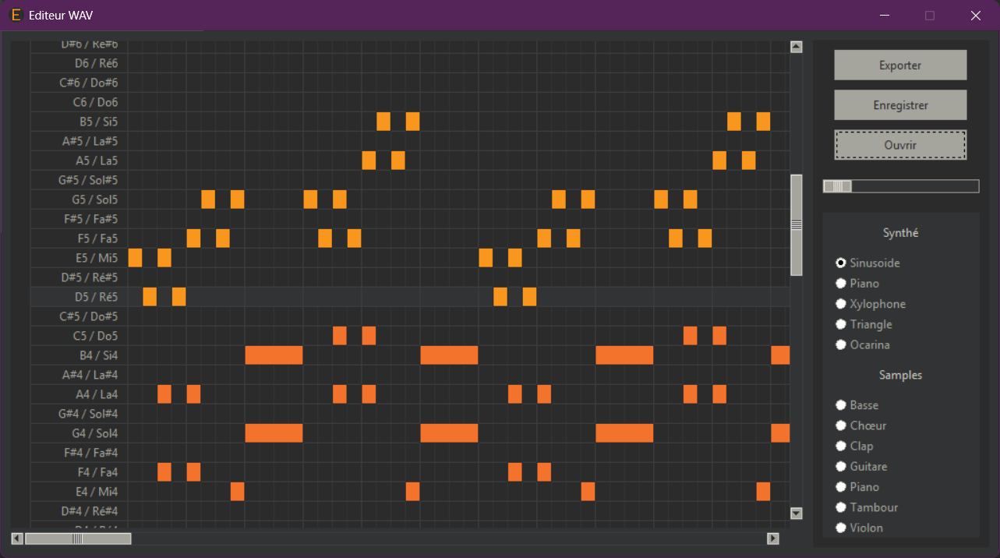

# Editeur .wav en Python

## Principe

Synthétiseur très basique avec plusieurs instruments recréés de toute pièce ou à partir de samples. L'utilisateur place des notes sur une grille, en choisissant l'instrument et le tempo du morceau.

## Instruments

### Synthétisés

La **sinusoïde** est un signal sinusoïdal classique :

$$A \sin(2 \pi f t)$$

Le **piano** est reconstitué à partir de [cette vidéo](https://youtu.be/ogFAHvYatWs?si=EjqRqyAv2T-9sVZA) :

$$a A (1 + 16 t e^{-6t}) (v + v^3)$$
$$v = 0.6 e^{-0.003 \pi f t} \sin(2 \pi f t) + 0.4 e^{-0.003 \pi f t} \sin(4 \pi f t)$$
$$a = \left(
    \begin{array}{ll}
        \frac{l - t}{0.05} & \text{si } t \geq l - 0.05 \\
        1 & \text{sinon}
    \end{array}
\right.$$

Le **xylophone** est une sinusoïde avec une enveloppe en exponentielle décroissante :

$$A e^{-8t} \sin(2 \pi f t)$$

Le **triangle** est une approximation d'un signal triangulaire à 10 harmoniques :

$$A \frac{8}{\pi^2} \sum_{j = 0}^{10}{(-1)^j \frac{\sin(2 \pi (2j - 1) f t)}{(2j + 1)^2}}$$

L'**ocarina** est similaire à un xylophone avec une atténuation :

$$a A e^{-t} \sin(2 \pi f t)$$
$$a = \left(
    \begin{array}{ll}
        \frac{t}{0.05} & \text{si } t \leq 0.05 \\
        \frac{l - t}{0.05} & \text{si } t \geq l - 0.05 \\
        1 & \text{sinon}
    \end{array}
\right.$$

### Samples

Les samples sont importés depuis [LMMS](https://lmms.io/). Ils sont ensuite transformés grâce à la bibliothèque [librosa](https://librosa.org/).

## Sources

- [Live coding musical instruments with mathematics](https://youtu.be/ogFAHvYatWs?si=EjqRqyAv2T-9sVZA)
- [LMMS](https://lmms.io/)
- [librosa](https://librosa.org/)
